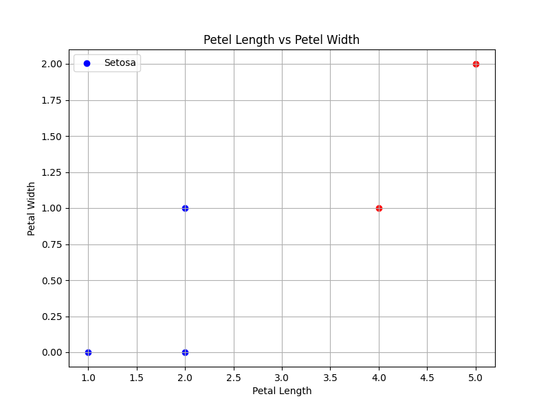

# Supervised Logistic Regression Example: Iris Dataset

This repository contains a simple example of applying logistic regression to a small dataset. The goal is to classify flowers as "Iris Setosa" or "Not Setosa" based on petal length and petal width.

## Table of Contents

1. [Introduction](#introduction)
2. [Dataset](#dataset)
3. [Algebraic Method](#algebraic-method)
4. [Python Implementation](#python-implementation)
5. [Plotting the Data](#plotting-the-data)
6. [Results](#results)
7. [Conclusion](#conclusion)

## Introduction

Logistic Regression is a simple yet powerful classification algorithm commonly used for binary classification problems. This example demonstrates how logistic regression can be used to classify flowers in the Iris dataset.

## Dataset

The dataset used in this example consists of five data points with two features:

| Petal Length | Petal Width | Label         |
|--------------|-------------|---------------|
| 1            | 0           | 1 (Setosa)    |
| 4            | 1           | 0 (Not Setosa)|
| 2            | 0           | 1 (Setosa)    |
| 5            | 2           | 0 (Not Setosa)|
| 2            | 1           | 1 (Setosa)    |

## Algebraic Method

### Linear Combination

The linear combination in logistic regression is calculated as:

$$
z = w_1 \cdot x_1 + w_2 \cdot x_2 + b
$$

For example, with arbitrary weights $w_1 = 0.5$, $w_2 = -0.5$, and $b = 0$, for input $x_1 = 2$ and $x_2 = 1$:

$$
z = 0.5 \cdot 2 + (-0.5) \cdot 1 + 0 = 1 - 0.5 = 0.5
$$

### Sigmoid Function

The sigmoid function is applied to the linear combination $z$ to map it to a probability:

$$
\sigma(z) = \frac{1}{1 + e^{-z}}
$$

Applying it to $z = 0.5$:

$$
\sigma(0.5) = \frac{1}{1 + e^{-0.5}} \approx 0.6225
$$

### Cost Function (Log-Loss)

The cost function measures how well the model’s predictions match the actual labels.

For $y = 1$:

$$
\text{Cost} = -\log(0.6225) \approx 0.4748
$$

For $y = 0$:

$$
\text{Cost} = -\log(0.3775) \approx 0.9741
$$

### Gradient Descent

The model adjusts weights $w_1$, $w_2$, and bias $b$ iteratively to minimize the cost function:

$$
w_j := w_j - \alpha \frac{\partial J(\theta)}{\partial w_j}
$$

## Python Implementation

Here’s how to implement logistic regression using Python's scikit-learn:

```python
from sklearn.linear_model import LogisticRegression

# Training data
X_train = [[1, 0], [4, 1], [2, 0], [5, 2], [2, 1]]
y_train = [1, 0, 1, 0, 1]

# Initialize the model
model = LogisticRegression()

# Train the model
model.fit(X_train, y_train)

# The learned weights (coefficients) and bias (intercept)
print(f"Weights: {model.coef_}")
print(f"Bias: {model.intercept_}")
```
### Output

```python
Accuracy: 1.0
```

This indicates that the model made perfect predictions on the test data.

## Plotting the Data

To visualize the data on a Cartesian plane:

```python
import matplotlib.pyplot as plt

# Your dataset
X_train = [[1, 0], [4, 1], [2, 0], [5, 2], [2, 1]]
y_train = [1, 0, 1, 0, 1]

# Convert data to separate lists for plotting
x1 = [point[0] for point in X_train]  # Petal Lengths
x2 = [point[1] for point in X_train]  # Petal Widths

# Create the plot
plt.figure(figsize=(8, 6))

# Plot each point and color based on the label
for i in range(len(X_train)):
    if y_train[i] == 1:
        plt.scatter(x1[i], x2[i], color='blue', label='Setosa' if i == 0 else "")
    else:
        plt.scatter(x1[i], x2[i], color='red', label='Not Setosa' if i == 0 else "")

# Labeling the plot
plt.title('Petal Length vs Petal Width')
plt.xlabel('Petal Length')
plt.ylabel('Petal Width')
plt.legend()
plt.grid(True)

# Show the plot
plt.show()
```

This will generate a scatter plot where points labeled as 1 are colored blue, and points labeled as 0 are colored red.



## Results

The model achieved an accuracy of 1.0, meaning it correctly classified all the test data points. The scatter plot visually demonstrates the data distribution and how well the logistic regression model fits the data.

## Conclusion

This example demonstrates the process of applying logistic regression to a small dataset, including an algebraic explanation, Python implementation, and data visualization. Logistic regression is a powerful tool for binary classification, and this example illustrates its effectiveness even with a simple dataset.
